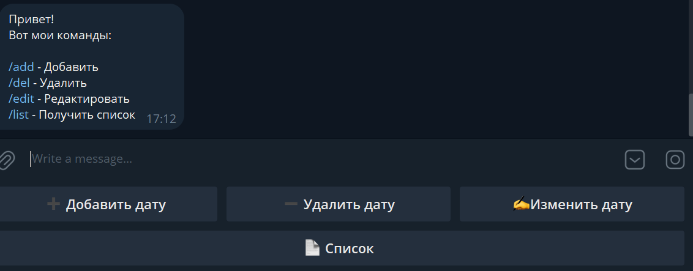
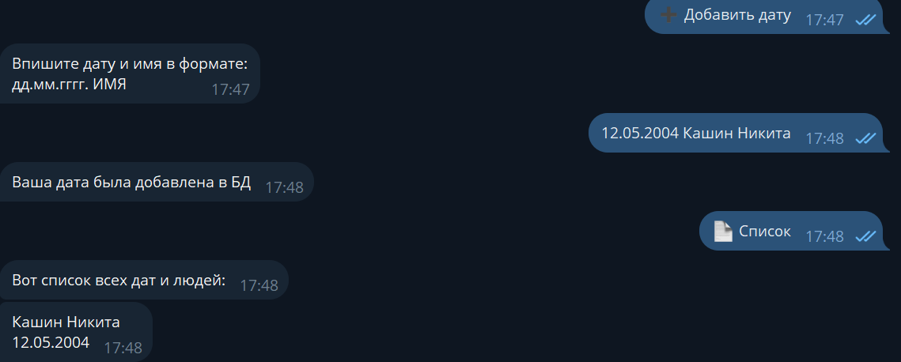
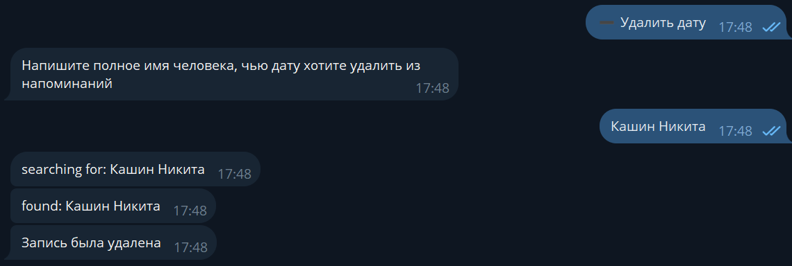

Бот для отправления уведомлений пользователю о днях рождения. Дни рождения пользователь вбивает в бота вручную

Примеры работы:

Стартовое окно бота \.

Добавление записи \.

Удаление записи \.

Также поддерживается изменение и вывод записей
